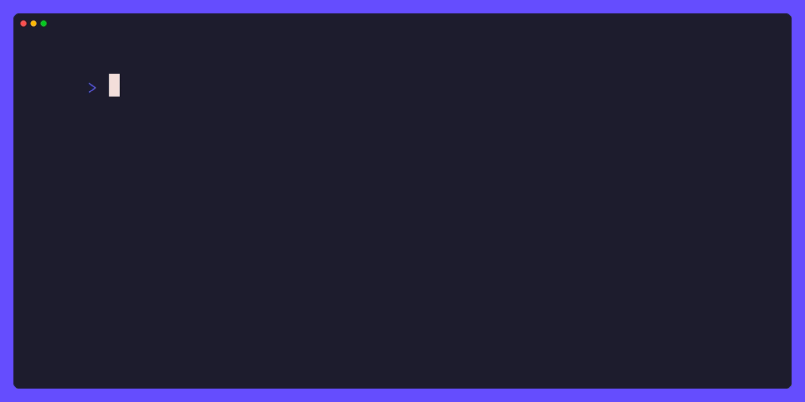

# Quix

Quix is a terminal manipulation library written in zig.



## Table of Contents
- [Quix](#Quix)
    - [Table of Contents](#table-of-contents)
    - [Getting Started](#getting-started)
    - [License](#License)

## Getting Started

Add quix as a dependency using `zig fetch`:

```sh
zig fetch --save git+https://github.com/wllfaria/quix.git
```

Update your `build.zig` to include quix:

```zig
const quix = b.dependency("quix", .{
    .target = target,
    .optimize = optimize,
});
```

<details>
  <summary>Example build.zig.</summary>

  ```zig
const std = @import("std");

pub fn build(b: *std.Build) void {
    const target = b.standardTargetOptions(.{});
    const optimize = b.standardOptimizeOption(.{});

    const quix = b.dependency("quix", .{
        .target = target,
        .optimize = optimize,
    });

    const app_mod = b.createModule(.{
        .root_source_file = b.path("src/main.zig"),
        .target = target,
        .optimize = optimize,
    });
    app_mod.addImport("quix", quix.module("quix"));

    const app = b.addExecutable(.{
        .name = "my_app",
        .root_module = app_mod,
    });

    b.installArtifact(app);

    const run_cmd = b.addRunArtifact(app);
    run_cmd.step.dependOn(b.getInstallStep());
    if (b.args) |args| {
        run_cmd.addArgs(args);
    }

    const run_step = b.step("run", "Run the app");
    run_step.dependOn(&run_cmd.step);

    const exe_unit_tests = b.addTest(.{ .root_module = app_mod });
    const run_exe_unit_tests = b.addRunArtifact(exe_unit_tests);

    const test_step = b.step("test", "Run unit tests");
    test_step.dependOn(&run_exe_unit_tests.step);
}
  ```
</details>

Modify your `src/main.zig` to look like this:

```zig
const quix = @import("quix");

pub fn main() !void {
    const styled = quix.style.new("Hello from quix!\n")
        .foreground(.White)
        .background(.DarkRed)
        .bold();

    try quix.style.printStyled(styled);
}
```

_You can also check the [examples](./examples) directory for different and more
advanced examples._

## License

This project, `quix` and all its sub-libraries are licensed under the MIT
license - see the [LICENSE](https://github.com/wllfaria/quix/blob/main/LICENSE)
file for details.
